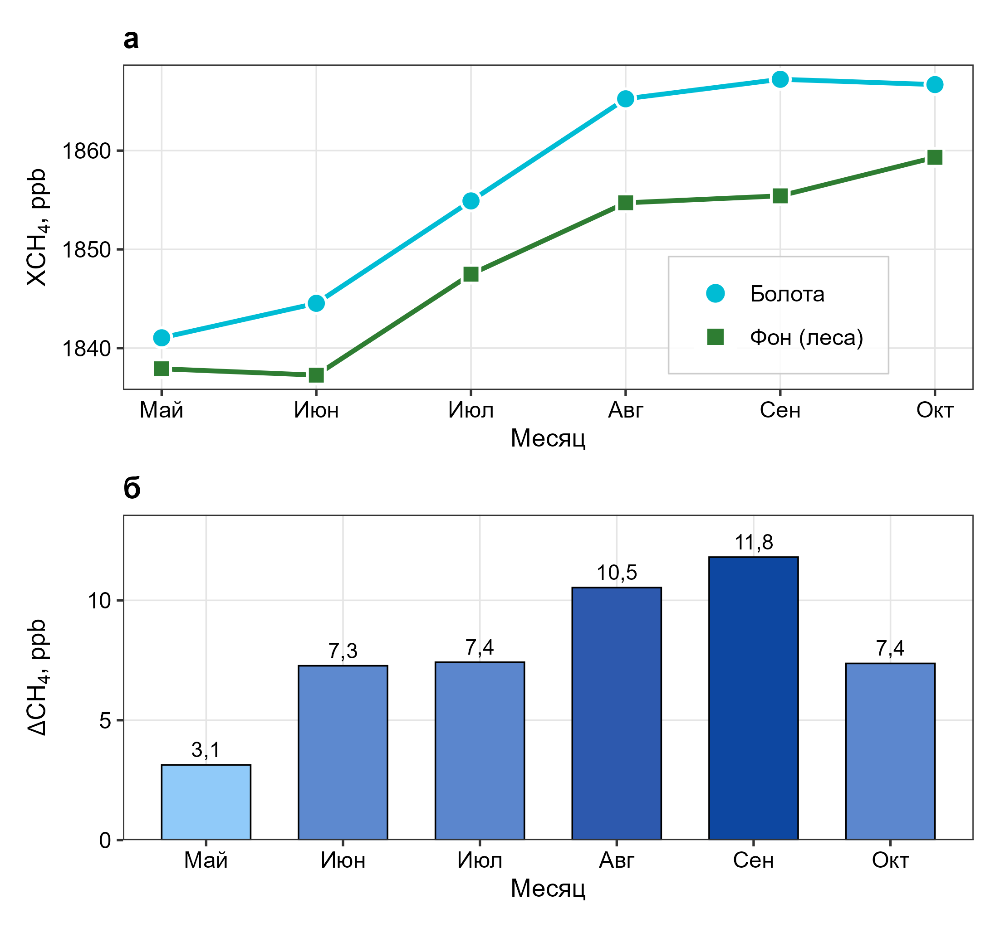

# WetCH4 Monitor

Regional methane enhancement monitoring tool for the West Siberian peatlands.
Links TROPOMI atmospheric CH₄ retrievals with a Copernicus Global Land Cover
wetland mask and three ground eddy-covariance stations to produce a spatially
explicit ΔCH₄ anomaly field (wetland minus forest background).

**Study area:** West Siberian Plain (WSP), eight natural zones from tundra to
steppe, May–October, 2019–2025.

**Live app:**
[WetCH4 Monitor on Google Earth Engine](https://nodal-thunder-481307-u1.projects.earthengine.app/view/wetch4-monitor)



---

## Why this project

West Siberian peatlands are one of the largest natural sources of methane in
the Northern Hemisphere, yet high-latitude emissions remain poorly constrained
by in-situ networks alone. This project:

* **Turns TROPOMI scenes into a practical decision tool** — one click in a
  public Earth Engine app shows where and when wetland CH4 is elevated, by
  zone, by month, with a total emission estimate for the whole plain.
* **Links satellite signal to ground truth.** Three eddy-covariance stations
  (Mukhrino, Bakchar, Zotino) anchor the space-borne enhancement to measured
  fluxes, so the map is not just a colourful image but a calibrated proxy.
* **Is fully reproducible.** Every figure in the article is rebuilt from the
  CSV tables and R scripts shipped here, and every GEE asset is rebuilt from
  the JS modules in `gee/`. Nothing is hand-edited.
* **Is reusable.** The workflow — land-cover mask + TROPOMI monthly mean +
  forest-background subtraction + zonal aggregation — transfers directly to
  the Hudson Bay Lowlands, Congo basin, or any other large peatland region
  where TROPOMI signal-to-noise is sufficient.

Practical audiences:

* Climate-modelling groups needing a regional bottom-up prior.
* Policy analysts tracking Russia's peatland-CH4 inventory.
* Students and educators exploring remote sensing of greenhouse gases.
* Fieldwork planners choosing campaign locations and timing.

---

## Repository layout

```
gee/                      Google Earth Engine JavaScript modules
  01_wetland_mask.js      CGLS-LC100 reclassification (wetland / forest / water)
  02_tropomi_monthly.js   TROPOMI L3 monthly composites (XCH4)
  03_enhancement.js       delta CH4 = XCH4(wetland) - XCH4(forest)
  04_three_variables.js   delta CH4 x wetland fraction x air temperature
  05_validation.js        Three-station ground-truth comparison
  06_emission_estimate.js Single transfer-function emission estimate
  07_app.js               Public GEE App UI (v3, the one hosted above)
  08_zonal_stats.js       delta CH4 statistics per natural zone
  09_export_assets.js     One-off export: precomputed tables + images
  10_article_exports.js   CSV tables used by the R figure scripts
  11..15_*.js             Auxiliary exports (ArcGIS, figure assets)
  lib/                    Shared constants, palettes, utilities

R/                        Figure scripts for the accompanying article
  fig2_seasonal.R         Seasonal XCH4 and delta CH4 across WSP
  fig3_zonal.R            Zonal delta CH4 + delta CH4 vs air-temperature scatter
  fig4_zonal_seasonal.R   Seasonal delta CH4 by zone
  fig5_stations.R         Seasonal XCH4 and delta CH4 at three stations
  run_all.R               Re-build all figures in one pass
  README.md               R usage notes

article/
  data/                   CSV tables exported from GEE (inputs for R scripts)
  figures/                Final PNG figures (Fig. 2-5)

calibration/              Ground CH4 flux data (Mukhrino, Bakchar, ZOTTO)
```

---

## Data sources

| Dataset            | Role                                    | Provider |
|--------------------|-----------------------------------------|----------|
| TROPOMI L3 XCH4    | Column-averaged CH4 concentration       | Sentinel-5P / ESA |
| CGLS LC100 2019    | 100-m land cover - wetland / forest map | Copernicus Global Land |
| ERA5-Land monthly  | 2-m air temperature                     | ECMWF |
| In-situ CH4 fluxes | Calibration / validation                | Mukhrino, Bakchar, ZOTTO towers |
| WSP boundary       | 8 natural zones                         | custom vector asset `zapsib` |

All TROPOMI, CGLS and ERA5 data are fetched on the fly from the Earth Engine
catalog. In-situ flux data are shipped as CSVs in `calibration/`.

---

## Reproducing the figures

### Requirements

* R >= 4.3
* R packages: `ggplot2`, `dplyr`, `readr`, `patchwork`, `ggrepel`

```r
install.packages(c("ggplot2", "dplyr", "readr", "patchwork", "ggrepel"))
```

### Run

```bash
cd R
Rscript run_all.R
```

Each script reads CSVs from `article/data/` and writes PNGs (300-400 dpi)
to `article/figures/`. See [`R/README.md`](R/README.md) for per-figure details.

---

## Rebuilding the Earth Engine assets

All map layers and chart data used by the app come from assets under
`projects/nodal-thunder-481307-u1/assets/WetLandCH4/`. To rebuild from scratch:

1. Open [code.earthengine.google.com](https://code.earthengine.google.com/)
2. Load `gee/09_export_assets.js` and `gee/08_zonal_stats.js`
3. Hit **Run** in each — exports go to the Tasks tab, run them all
4. Wait for completion (30-60 min depending on region size)
5. Share the folder publicly
   (**Assets → right-click WetLandCH4 → Share → Anyone can read**) so the
   published App can read them
6. Open `gee/07_app.js` and publish as an App

Asset catalogue produced by these scripts:

| Asset                | Type              | Records | Source                |
|----------------------|-------------------|---------|-----------------------|
| `wetland_mask`       | Image (4-class)   | raster  | `09_export_assets.js` |
| `delta_ch4_july_mean`| Image             | raster  | `09_export_assets.js` |
| `enhancement_full`   | FeatureCollection | 42      | `09_export_assets.js` |
| `seasonal_mean`      | FeatureCollection | 6       | `09_export_assets.js` |
| `zonal_stats`        | FeatureCollection | 8       | `09_export_assets.js` |
| `zonal_seasonal`     | FeatureCollection | 48      | `08_zonal_stats.js`   |
| `stations`           | FeatureCollection | 3       | `09_export_assets.js` |

---

## Known limitations

* TROPOMI reports **column-averaged XCH4**, not a surface flux. delta CH4 is a
  spatial proxy, not a direct emission measurement.
* Winter months (Nov-Apr) are excluded — retrieval SNR is too low under snow.
* Native resolution is ~7 km; smaller wetland patches are diluted.
* The emission estimate uses a single transfer function calibrated against the
  three towers (mean flux ~3 mg CH4 per m^2 per h, May-October). Zonal
  transferability is not validated.

---

## Citation

Manuscript in preparation. Please cite the repository itself until published:

> Sizov O. (2026). WetCH4 Monitor — regional methane enhancement monitoring
> from TROPOMI over the West Siberian peatlands. GitHub repository.
> https://github.com/SizovOleg/WetCH4-Monitor

---

## Developer

**Oleg Sizov** · [kabanin1983@gmail.com](mailto:kabanin1983@gmail.com)

---

## License

[MIT](LICENSE) for code. Figures and tables are provided for reference and may
be reused with attribution.
